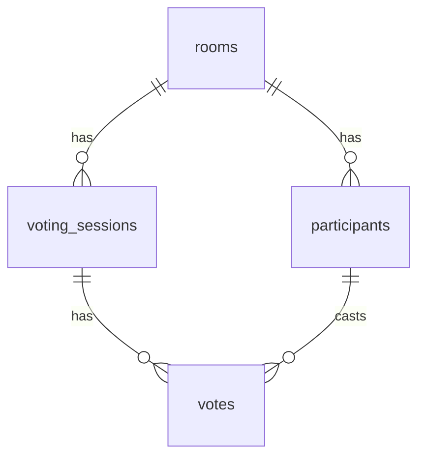

# Scrum Poker

[](https://scrum-porker-gamma.vercel.app)
[](LICENSE)

チームでストーリーポイントを見積もるためのリアルタイム スクラムポーカーアプリ。
アカウント登録不要 — URLを共有するだけで、すぐにプランニングポーカーを始められます。

**Demo:** https://scrum-porker-gamma.vercel.app

<!-- TODO: スクリーンショットを docs/images/ に配置して以下を有効化
<p align="center">
  
</p>
-->

## 機能

- **ルーム作成・参加** — 6桁のルームコードで簡単にチームメンバーを招待
- **リアルタイム同期** — Supabase Realtime + ポーリングで投票状況をリアルタイム反映
- **匿名認証** — アカウント登録不要。アクセスするだけですぐに使える
- **カードセット** — フィボナッチ数列 / Tシャツサイズ / 2のべき乗 から選択可能
- **自動公開** — 全員投票後に自動で結果を表示するオプション
- **タイマー** — 30秒〜5分のタイマー設定で議論の時間管理
- **セッション履歴** — 過去の投票結果を一覧で確認
- **統計表示** — 平均値・中央値・最頻値を自動計算（特殊カード `?` `∞` `☕` は除外）
- **招待・共有** — QRコード / URLコピー / Web Share API でメンバーを招待
- **ダークモード** — ライト / ダーク / システム設定の3モード切替
- **多言語対応** — 日本語・英語に対応 (next-intl)

## 技術スタック

| カテゴリ | 技術 |
|---------|------|
| フレームワーク | [Next.js](https://nextjs.org/) 16 (App Router, Turbopack) |
| 言語 | TypeScript 5 |
| バックエンド | [Supabase](https://supabase.com/) (PostgreSQL, Auth, Realtime) |
| 状態管理 | [Zustand](https://zustand.docs.pmnd.rs/) |
| UI | [shadcn/ui](https://ui.shadcn.com/) + [Tailwind CSS](https://tailwindcss.com/) 4 |
| バリデーション | [Zod](https://zod.dev/) + [React Hook Form](https://react-hook-form.com/) |
| 多言語 | [next-intl](https://next-intl.dev/) |
| テーマ | [next-themes](https://github.com/pacocoursey/next-themes) |
| テスト | [Vitest](https://vitest.dev/) (単体) + [Playwright](https://playwright.dev/) (E2E) |
| デプロイ | [Vercel](https://vercel.com/) |

## セットアップ

### 前提条件

- Node.js 20+
- [pnpm](https://pnpm.io/)
- [Docker](https://www.docker.com/) (ローカル Supabase 用)

### ローカル開発

```bash
# リポジトリをクローン
git clone https://github.com/bossagyu/scrum-porker.git
cd scrum-porker

# 依存関係をインストール
pnpm install

# 環境変数を設定
cp .env.local.example .env.local

# Supabase をローカルで起動
npx supabase start

# .env.local の NEXT_PUBLIC_SUPABASE_ANON_KEY を更新
# （npx supabase status で表示される anon key をコピー）

# 開発サーバーを起動
pnpm dev
```

http://localhost:3000 にアクセスして動作確認。

## コマンド一覧

```bash
# 開発
pnpm dev                # 開発サーバー起動 (Turbopack, ポート 3000)
npx supabase start      # ローカル Supabase 起動
npx supabase db reset   # DB リセット & マイグレーション再適用

# テスト
pnpm test               # 単体テスト (Vitest)
pnpm test:watch         # 単体テスト (ウォッチモード)
pnpm test:e2e           # E2E テスト (Playwright)
pnpm test:e2e:ui        # E2E テスト (UI モード)

# ビルド & 品質
pnpm build              # プロダクションビルド
pnpm lint               # ESLint
pnpm format             # Prettier フォーマット
```

## プロジェクト構成

```
src/
├── actions/            # Server Actions (ルーム作成, 参加, 投票, 公開, リセット)
├── app/                # Next.js App Router
│   ├── page.tsx        # トップページ (ルーム作成 & 参加フォーム)
│   └── room/[code]/    # ルームページ (投票画面)
├── components/
│   ├── layout/         # ヘッダー (言語切替含む), テーマ切替
│   ├── room/           # ルーム関連コンポーネント
│   └── ui/             # shadcn/ui コンポーネント
├── lib/
│   └── supabase/       # Supabase クライアント & 型定義
├── stores/             # Zustand ストア (リアルタイム同期)
└── types/              # 共有型定義

e2e/                    # Playwright E2E テスト
messages/               # 翻訳ファイル (ja.json, en.json)
supabase/migrations/    # DB マイグレーション
```

## データベース



全テーブルに Row Level Security (RLS) を適用。ユーザーは自分が参加しているルームのデータのみアクセス可能。

## ライセンス

MIT
