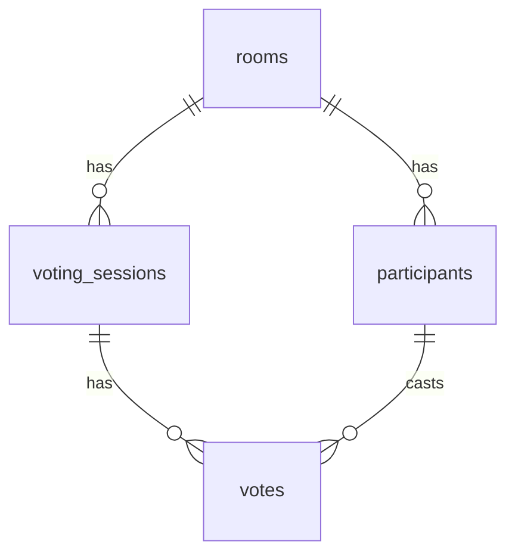

# README 改善 実装計画

> **For Claude:** REQUIRED SUB-SKILL: Use superpowers:executing-plans to implement this plan task-by-task.

**Goal:** READMEを総合的にレベルアップ — バッジ、スクリーンショット枠、最新機能の反映、Mermaid ER図を追加する。

**Architecture:** 既存のREADME構成を維持しつつ、ヘッダー・機能一覧・技術スタック・プロジェクト構成・データベースセクションを改善。新規ファイルはREADME.mdの編集のみ。

**Tech Stack:** Markdown, GitHub Flavored Markdown (バッジ, Mermaid)

---

### Task 1: スクリーンショット用ディレクトリ作成

**Files:**
- Create: `docs/images/.gitkeep`

**Step 1: ディレクトリ作成**

```bash
mkdir -p docs/images
touch docs/images/.gitkeep
```

**Step 2: コミット**

```bash
git add docs/images/.gitkeep
git commit -m "chore: スクリーンショット用ディレクトリを作成"
```

---

### Task 2: ヘッダー部分の改善

**Files:**
- Modify: `README.md:1-5`

**Step 1: ヘッダーを編集**

タイトル直下にバッジを追加し、キャッチコピーを更新、スクリーンショットのプレースホルダーを配置:

```markdown
# Scrum Poker

[](https://scrum-porker-gamma.vercel.app)
[](LICENSE)

チームでストーリーポイントを見積もるためのリアルタイム スクラムポーカーアプリ。
アカウント登録不要 — URLを共有するだけで、すぐにプランニングポーカーを始められます。

👉 **https://scrum-porker-gamma.vercel.app**

<!-- TODO: スクリーンショットを docs/images/ に配置して以下を有効化
<p align="center">
  
</p>
-->
```

**Step 2: ブラウザでプレビュー確認**

GitHubのMarkdownプレビュー、または `pnpm dlx marked README.md` などでバッジの表示を確認。

---

### Task 3: 機能一覧の更新

**Files:**
- Modify: `README.md:7-17` (機能セクション)

**Step 1: 機能一覧を編集**

既存8項目の後に、最近追加された3機能を追記:

```markdown
- **招待・共有** — QRコード / URLコピー / Web Share API でメンバーを招待
- **ダークモード** — ライト / ダーク / システム設定の3モード切替
- **多言語対応** — 日本語・英語に対応 (next-intl)
```

---

### Task 4: 技術スタックの更新

**Files:**
- Modify: `README.md:19-29` (技術スタックテーブル)

**Step 1: テーブルに行を追加**

バリデーション行の下に以下を追加:

```markdown
| 多言語 | [next-intl](https://next-intl.dev/) |
| テーマ | [next-themes](https://github.com/pacocoursey/next-themes) |
```

---

### Task 5: プロジェクト構成の更新

**Files:**
- Modify: `README.md:84-103` (プロジェクト構成セクション)

**Step 1: ディレクトリツリーに `messages/` を追加**

```
src/
├── actions/            # Server Actions (ルーム作成, 参加, 投票, 公開, リセット)
├── app/                # Next.js App Router
│   ├── page.tsx        # トップページ (ルーム作成 & 参加フォーム)
│   └── room/[code]/    # ルームページ (投票画面)
├── components/
│   ├── layout/         # ヘッダー, テーマ切替, 言語切替
│   ├── room/           # ルーム関連コンポーネント
│   └── ui/             # shadcn/ui コンポーネント
├── lib/
│   └── supabase/       # Supabase クライアント & 型定義
├── stores/             # Zustand ストア (リアルタイム同期)
└── types/              # 共有型定義

e2e/                    # Playwright E2E テスト
messages/               # 翻訳ファイル (ja.json, en.json)
supabase/migrations/    # DB マイグレーション
```

---

### Task 6: データベースセクションをMermaid ER図に更新

**Files:**
- Modify: `README.md:105-111` (データベースセクション)

**Step 1: テキスト図をMermaid図に置換**

````markdown
## データベース



全テーブルに Row Level Security (RLS) を適用。ユーザーは自分が参加しているルームのデータのみアクセス可能。
````

---

### Task 7: 全変更をコミット

**Step 1: 差分確認**

```bash
git diff README.md
```

変更内容が意図通りか確認。

**Step 2: コミット**

```bash
git add README.md
git commit -m "docs: READMEを改善 - バッジ・最新機能・Mermaid ER図を追加"
```
